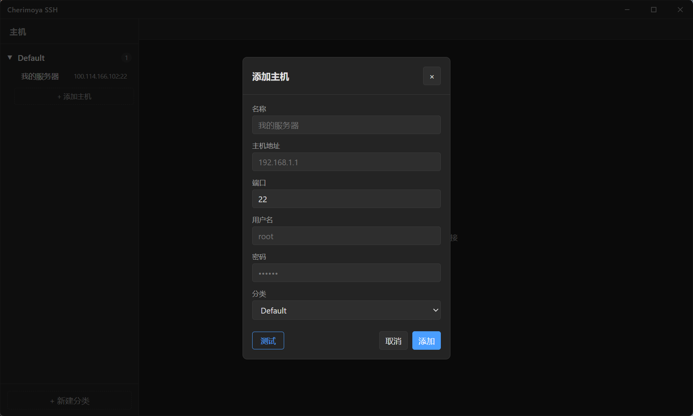
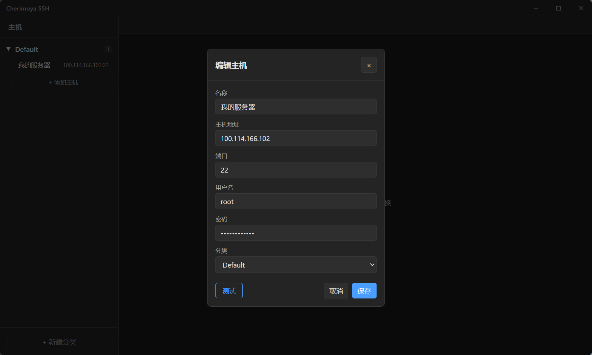
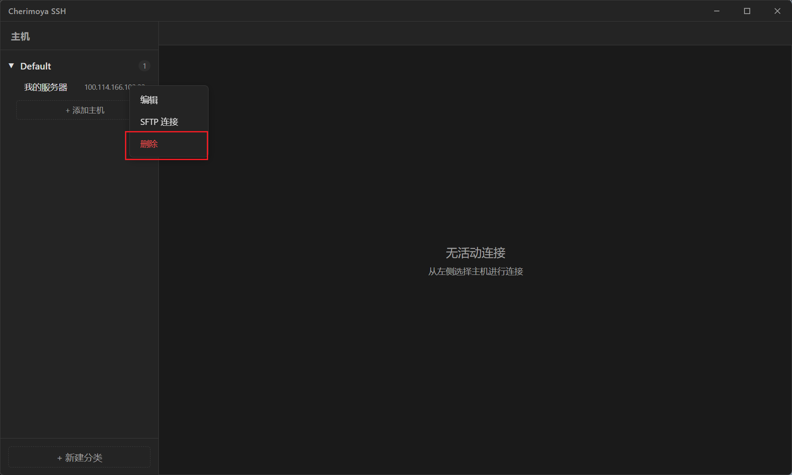
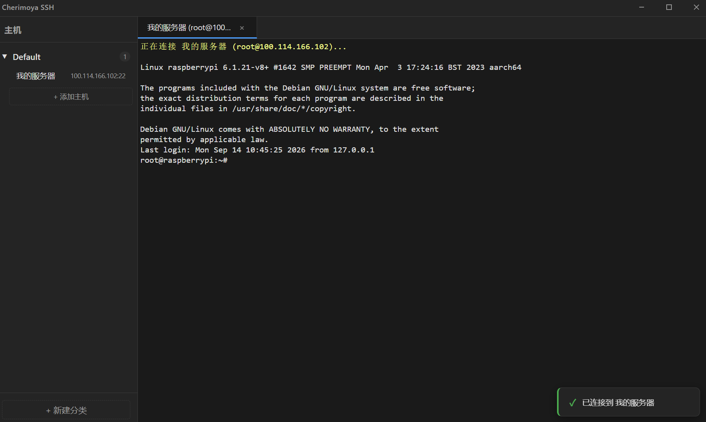
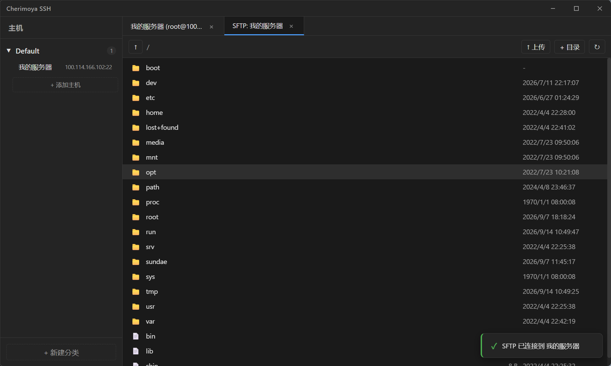
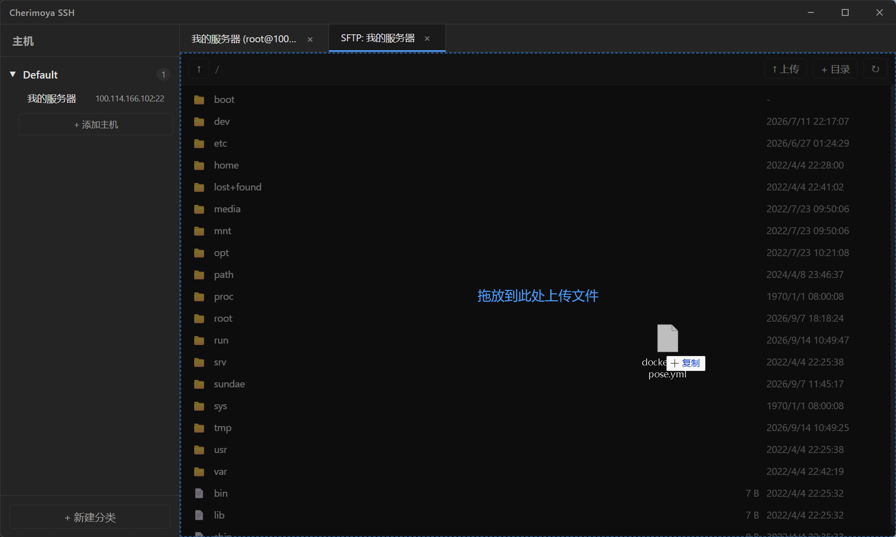
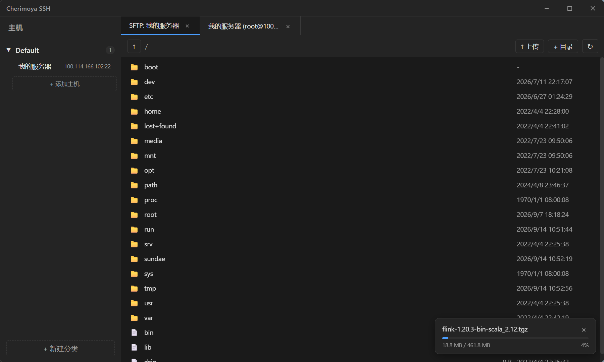

# Cherimoya SSH

<p align="center">
  
</p>

<p align="center">
  <strong>🍈 轻量、现代的跨平台桌面 SSH 客户端</strong>
</p>

<p align="center">
  
  
  
  
  
</p>

---
## 📖 项目介绍

Cherimoya SSH 是一款基于 **Tauri v2** + **Vue 3** + **Rust** 构建的跨平台桌面 SSH 客户端。后端采用 Rust 生态的高性能 SSH 库 [russh](https://crates.io/crates/russh)，前端使用 [xterm.js](https://xtermjs.org/) 渲染终端界面，兼具原生应用性能与现代前端开发体验。

项目名称来源于热带水果「释迦果」（Cherimoya），寓意甜蜜、高效的 SSH 连接体验 🍈。

---
## 📸 功能截图展示

<p align="center">
  
  <br/><em>添加主机</em>
</p>

<p align="center">
  
  <br/><em>编辑主机</em>
</p>

<p align="center">
  
  <br/><em>删除主机</em>
</p>

<p align="center">
  
  <br/><em>连接主机</em>
</p>

<p align="center">
  
  <br/><em>SFTP 文件管理</em>
</p>

<p align="center">
  
  <br/><em>拖拽文件上传</em>
</p>

<p align="center">
  
  <br/><em>文件下载进度</em>
</p>

---


## ✨ 核心功能

- **🔌 SSH 连接管理** — 支持密码认证方式连接远程服务器，底层基于 russh 提供稳定可靠的 SSH 会话
- **📁 主机分组管理** — 支持自定义分类（类别），自由添加、编辑、删除主机配置，数据自动持久化到本地
- **🗂️ 多标签页终端** — 支持同时打开多个 SSH 会话，以标签页形式自由切换，互不干扰
- **🖥️ SFTP 文件传输** — 内置 SFTP 支持，可在终端会话中进行文件上传与下载操作
- **🎨 深色主题** — 默认深色配色方案，适合长时间编码和运维工作，减少视觉疲劳
- **🪟 自定义窗口栏** — 隐藏系统原生窗口装饰，使用自定义标题栏，提供最小化/最大化/关闭按钮，支持拖拽移动窗口
- **📐 终端自适应缩放** — 终端区域随窗口大小自动调整，SSH PTY 同步 resize

## 🏗️ 技术架构

| 层级 | 技术栈 | 说明 |
|------|--------|------|
| 桌面框架 | [Tauri v2](https://v2.tauri.app/) | 轻量级桌面应用框架，包体积小 |
| 前端 | Vue 3 + TypeScript + Vite | 响应式 UI 框架 |
| 终端渲染 | [xterm.js](https://xtermjs.org/) | 高性能浏览器终端模拟器 |
| SSH 后端 | [russh](https://crates.io/crates/russh) + Tokio | Rust 异步 SSH 协议实现 |
| SFTP | [russh-sftp](https://crates.io/crates/russh-sftp) | Rust SFTP 客户端 |

## 🚀 快速开始

### 环境要求

- [Node.js](https://nodejs.org/) >= 18
- [Rust](https://www.rust-lang.org/) (stable)
- 系统级依赖：
  - Windows：通常无需额外安装
  - macOS：需安装 Xcode Command Line Tools

### 开发模式

```bash
# 安装前端依赖
npm install

# 启动完整 Tauri 应用（含 Vite 热更新 + Rust 后端）
npm run tauri dev
```

### 构建打包

```bash
npm run tauri build
```

构建产物位于 `src-tauri/target/release/bundle/` 目录。

## 📂 项目结构

```
cherimoya-ssh/
├── src/                      # Vue 前端源码
│   ├── components/           # UI 组件
│   │   ├── App.vue           # 根组件，连接调度
│   │   ├── TitleBar.vue      # 自定义标题栏
│   │   ├── Sidebar.vue       # 侧边栏（主机列表 + 分类）
│   │   ├── TabBar.vue        # 标签栏
│   │   ├── TerminalPane.vue  # 终端面板（xterm.js）
│   │   ├── SftpPane.vue      # SFTP 文件管理面板
│   │   ├── HostForm.vue      # 主机编辑表单
│   │   ├── DialogHost.vue    # 主机对话框容器
│   │   ├── ConfirmDialog.vue # 确认对话框
│   │   ├── PromptDialog.vue  # 输入提示对话框
│   │   ├── NotificationHost.vue    # 通知容器
│   │   └── SftpProgressHost.vue    # SFTP 进度容器
│   ├── composables/          # 组合式函数（状态管理）
│   │   ├── useHosts.ts       # 主机/分类管理
│   │   ├── useTabs.ts        # 标签页管理
│   │   └── useConnections.ts # SSH 连接总线
│   └── types/                # TypeScript 类型定义
├── src-tauri/                # Rust 后端源码
│   ├── src/
│   │   ├── main.rs           # 入口
│   │   ├── lib.rs            # Tauri 插件注册
│   │   ├── ssh/              # SSH 模块
│   │   │   ├── commands.rs   # Tauri 命令（ssh_connect/send/resize/disconnect）
│   │   │   ├── manager.rs    # 连接管理器
│   │   │   └── session.rs    # russh 会话实现
│   │   └── sftp/             # SFTP 模块
│   │       ├── commands.rs   # SFTP 命令
│   │       ├── manager.rs    # SFTP 管理器
│   │       └── session.rs    # SFTP 会话
│   └── icons/                # 应用图标
└── public/                   # 静态资源
```

## 📝 License

MIT

---

<p align="center">
  Made with ❤️ by Sundae
</p>